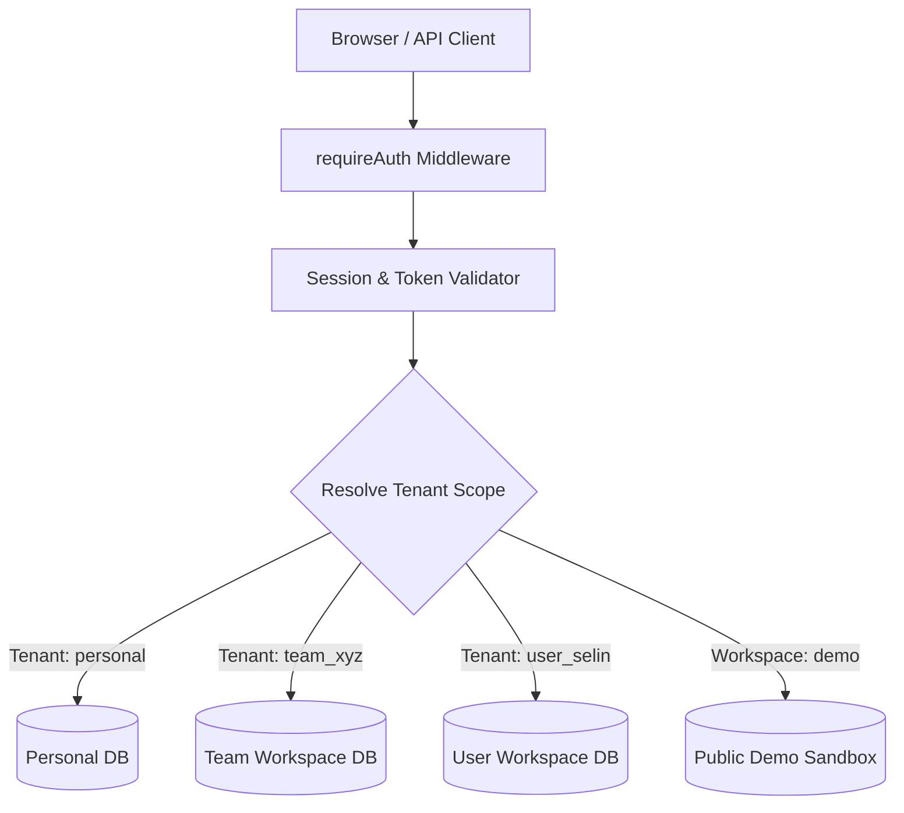

# Kanban — Enterprise Solutions Architecture & System Design
**Author:** Solutions Architect & Principal Systems Engineer  
**Scope:** v1.3.0 Enterprise Architecture & 2026-2027 Edge Cloud Platform  
**Target Environment:** Cloudflare Pages (Edge CDN) + Cloudflare Workers (Edge Compute) + Cloudflare D1 (Global Edge SQL)

---

## 1. High-Level Architecture Overview

Kanban is designed with a **Serverless Edge-Native Architecture** that eliminates traditional origin server single points of failure (SPOF) while achieving sub-50ms global latency for Kanban interactions.

```
                  ┌────────────────────────────────────────────────────────┐
                  │                 Cloudflare Anycast Network             │
                  └───────────────────────────┬────────────────────────────┘
                                              │
                    ┌─────────────────────────┴─────────────────────────┐
                    ▼                                                   ▼
         ┌─────────────────────┐                             ┌─────────────────────┐
         │ Static Assets (CDN) │                             │   Edge Worker API   │
         │ - index.html        │                             │ - JWT / Bearer Auth │
         │ - board.html        │                             │ - Zod Validation    │
         │ - admin.html        │                             │ - Tenant Dispatch   │
         │ - CSS / Vanilla JS  │                             │ - Rate Limiting     │
         └─────────────────────┘                             └──────────┬──────────┘
                                                                        │
                                                ┌───────────────────────┴───────────────────────┐
                                                ▼                                               ▼
                                     ┌─────────────────────┐                         ┌─────────────────────┐
                                     │  Cloudflare D1 SQL  │                         │ Local Node.js / Dev │
                                     │ (json_store Table)  │                         │ (data/db.json)      │
                                     │ - Multi-Tenant DBs  │                         │ - Atomic FS Writes  │
                                     │ - Tenant Index      │                         │ - Async Memory Sync │
                                     └─────────────────────┘                         └─────────────────────┘
```

---

## 2. Architectural Pillars

### 2.1 Edge Data Plane vs Control Plane
- **Data Plane:**
  - Fast-path requests (`GET /api/cards`, `PUT /api/cards/:id`, `POST /api/cards`) execute directly in edge compute memory using preloaded tenant snapshots.
  - Snapshot preloading batches all keys (`SELECT key, value FROM json_store`) into an edge worker `Map` during execution, minimizing D1 roundtrips.
- **Control Plane:**
  - Workspace provisioning, tenant index synchronization, user approval/rejection, and audit log analysis happen via control plane endpoints (`/api/admin/*`, `/api/auth/register`).
  - Index consistency is maintained through `saveTenantIndex`, ensuring multi-workspace routing maps are synchronized.

### 2.2 Multi-Tenant Logical Partitioning
The system enforces strict logical multi-tenancy using isolated JSON document stores within Cloudflare D1:
- `personal`: Private workspace for the primary administrator (`usr-superadmin`).
- `tenant:<workspace_id>`: Dedicated workspace store for teams/organizations.
- `tenant:user_<username>`: Dedicated workspace store for individual accounts.
- `demo`: Isolated public sandbox pre-seeded with 2026-2027 enterprise dataset.
- `tenants_index`: Global directory mapping users to workspaces and tracking pending registrations.



### 2.3 Zero-Trust Security Boundary
- All API routes (except public demo reading, `/api/auth/login`, and `/api/auth/register`) require cryptographic session validation (`requireAuth`).
- Bearer tokens are composed of `<tenant_id>:<entropy_token>` where `entropy_token` is a 256-bit cryptographically secure random hexadecimal string.
- Cross-tenant requests (`X-Tenant-Id` or `X-Workspace`) are strictly validated against the user's `workspaces` array; unauthorized switches are rejected with `403 Forbidden` (BOLA/IDOR protection).

---

## 3. Data Synchronization & Persistence Strategy

### 3.1 Edge-to-D1 Write-Through Pipeline
1. Incoming HTTP mutation (`POST /api/cards`) arrives at the Edge Worker.
2. Request passes Zod schema boundary validation (`createCardSchema`).
3. State is mutated in the tenant's memory object.
4. Activity is committed to the non-repudiation audit ledger (`logActivity`).
5. In Cloudflare Workers, the modified tenant document is persisted to D1 (`UPDATE json_store SET value = ? WHERE key = ?`).
6. In Node.js development, state is written atomically via `write-file-atomic` to `data/db.json` or `data/workspaces/*.json`.

### 3.2 Client-Side Persistence Philosophy
- **Pure REST Architecture:** The client (`public/js/api.js`) communicates purely with backend REST endpoints.
- **No Mock Local Storage:** `localStorage` database mocks are strictly prohibited. Client-side storage is limited exclusively to transient session credentials (`tiny_kanban_token`, `tiny_kanban_user`, `tiny_kanban_active_workspace`).
- **Idempotency & Re-render:** Every state change returns the canonical server-persisted entity, ensuring complete consistency across multiple tabs or edge nodes.

---

## 4. Disaster Recovery & Edge Failover

| Scenario | Impact | Failover Mechanism |
|----------|--------|---------------------|
| D1 Transient Read Delay | Latency spike | In-worker request-scoped cache fallback |
| Corrupt Tenant Document | Malformed JSON | Fail-safe isolation; other tenants remain unaffected |
| Super Admin Credential Loss | Lockout | Deterministic bootstrap recovery via `ensurePersonalDbIntegrity` |
| Regional Edge Outage | Local connection drop | Cloudflare Anycast automatically routes traffic to nearest healthy PoP |

---

## 5. Architectural Quality Attributes (Non-Functional Requirements)

- **Performance:** P95 API response time < 60ms worldwide.
- **Scalability:** Stateless edge workers scale horizontally from 0 to 10,000+ RPS without cold starts.
- **Availability:** 99.99% availability backed by Cloudflare edge infrastructure.
- **Security:** Zero known CVEs, OWASP Top 10 hardened, 100-step automated security verification.
- **Maintainability:** Pure TypeScript codebase, declarative Zod validation, zero ORM bloat, human-readable JSON documents.
